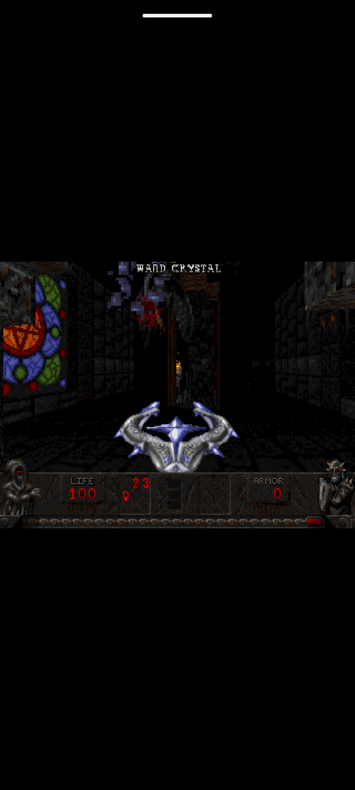

# Eretik — порт Heretic на Android

Порт классической игры **Heretic** (Raven Software, 1994) на Android на базе
[Chocolate Heretic](https://github.com/chocolate-doom/chocolate-doom) —
максимально точного source port оригинального движка — и SDL2.



## Состав

| Компонент | Версия | Назначение |
|---|---|---|
| chocolate-doom | git master | движок (`chocolate-heretic`) |
| SDL2 | 2.32.10 | видео, ввод, аудио |
| SDL2_mixer | 2.8.1 | звуковые эффекты (WAV) |
| SDL2_net | 2.2.0 | сетевая игра |

Исходники лежат в `deps/` (скачиваются скриптом ниже) и подключаются
в сборку через симлинки `app/src/main/jni/`.

## Требования

- Android SDK (platforms android-35+, build-tools)
- Android NDK **28.2.13676358** (прописан в `app/build.gradle.kts`)
- Java 17+
- `local.properties` с `sdk.dir=/путь/к/Android/sdk`

## Сборка

```bash
./gradlew assembleDebug
```

Готовый APK: `app/build/outputs/apk/debug/app-debug.apk`
(ABI: `arm64-v8a`, `armeabi-v7a`; minSdk 21; 16 КБ page-size alignment для Android 15+).

## Установка игровых данных (IWAD)

Движку нужен IWAD с ресурсами игры. Варианты:

- **Полная игра**: `heretic.wad` из легальной копии Heretic (Steam/GOG).
- **Shareware**: `heretic1.wad` (первый эпизод, свободно распространяется,
  зеркала idgames, файл `htic_v12.zip`).
- **Свободная замена**: [Blasphemer](https://github.com/Blasphemer/blasphemer)
  (`wad/blasphem.wad` уже лежит в репозитории; копия под именем `heretic.wad`
  использовалась для теста на скриншоте).

Файл нужно переименовать в `heretic.wad` и положить в одно из мест:

1. **Внутреннее хранилище приложения** (debug-сборка):
   ```bash
   adb push heretic.wad /data/local/tmp/
   adb shell "run-as com.eretik.heretic sh -c 'mkdir -p files && cat /data/local/tmp/heretic.wad > files/heretic.wad'"
   ```
2. **Внешняя папка приложения** — `/sdcard/Android/data/com.eretik.heretic/files/heretic.wad`:
   при первом запуске игра сама скопирует файл во внутреннее хранилище.

Конфиги (`default.cfg`, `extra.cfg`) и сейвы (`savegames/`) лежат во внутреннем
хранилище приложения, пути передаются движку аргументами из `HereticActivity`.

## Управление

Работают клавиатура, мышь (USB/Bluetooth) и геймпад — как в обычном
Chocolate Heretic. Экранных тач-контролей пока нет (SDL2 передаёт тач как
мышь) — для игры на телефоне нужен геймпад или клавиатура.

## Структура проекта

```
app/src/main/
├── AndroidManifest.xml            # activity, landscape, разрешения
├── java/com/eretik/heretic/
│   └── HereticActivity.java       # SDLActivity: библиотеки, аргументы, копирование WAD
├── java/org/libsdl/app/           # Java-обвязка SDL2
└── jni/
    ├── Android.mk                 # верхнеуровневый ndk-build
    ├── Application.mk             # ABI, APP_PLATFORM, 16KB alignment
    ├── config/config.h            # конфиг для chocolate-heretic
    ├── heretic/Android.mk         # модуль libheretic.so (списки исходников)
    ├── SDL -> deps/SDL2-2.32.10
    ├── SDL2_mixer -> deps/SDL2_mixer-2.8.1
    ├── SDL2_net -> deps/SDL2_net-2.2.0
    └── chocolate-doom -> ../chocolate-doom
```

## Лицензии

- Chocolate Doom / Heretic — GPLv2 (см. `chocolate-doom/COPYING`).
- SDL2, SDL2_mixer, SDL2_net — zlib.
- Blasphemer — свободные ресурсы (см. его репозиторий).
- Оригинальный `heretic.wad` — коммерческие данные, в репозиторий не входят.
