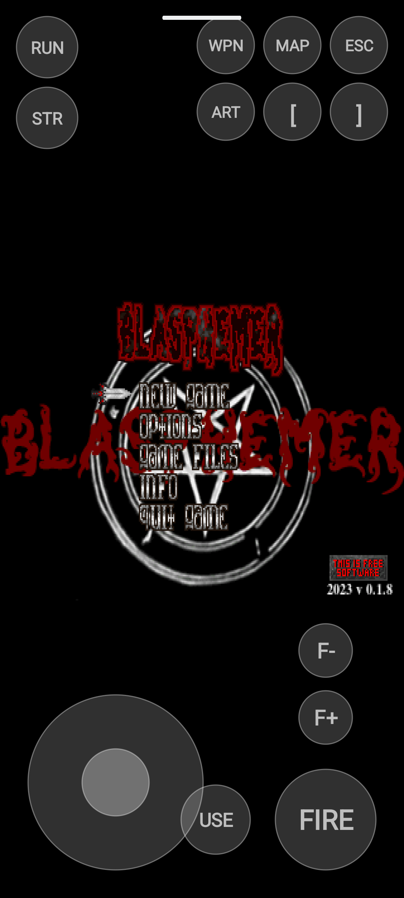

# Eretik

[](LICENSE)
[](https://github.com/akarakuts/eretik/actions/workflows/ci.yml)

English: [README.md](README.md)

**Eretik** — порт классической игры **Heretic** (Raven Software, 1994) на Android на базе
[Crispy Heretic](https://github.com/fabiangreffrath/crispy-doom)
(форк Chocolate Heretic с high-res 640×400, truecolor и uncapped FPS) и **SDL2**.


| | |
|---|---|
| Пакет | `com.eretik.heretic` |
| Версия | `1.1.0` (см. `app/build.gradle.kts`) |
| Движок | Crispy Heretic (`crispy-doom` git master) |
| Ориентация | Landscape |

## Возможности

- **Движок** — Crispy Heretic с truecolor на этапе компиляции (`-DCRISPY_TRUECOLOR`),
  high-res / truecolor в `default.cfg` / `extra.cfg`.
- **Тач-оверлей** — экранный джойстик и кнопки (HOLD / TOGGLE / TAP), шлют SDL key
  events; клавиатура, мышь и геймпад работают как в десктопном Crispy Heretic.
- **Выбор IWAD** — `heretic.wad` → `heretic1.wad` → `blasphem.wad` во внутреннем
  хранилище; импорт из app-specific external files.
- **Сборка под Android** — ABI `arm64-v8a` + `armeabi-v7a`, minSdk 21,
  выравнивание страниц 16 КБ (Android 15+).

## Стек

| Компонент | Версия | Назначение |
|---|---|---|
| crispy-doom | git master | движок (`crispy-heretic`), C |
| SDL2 | 2.32.10 | видео, ввод, аудио |
| SDL2_mixer | 2.8.1 | звуки (только WAV; музыка — OPL) |
| SDL2_net | 2.2.0 | сетевая игра |
| Android Gradle Plugin | 9.2.1 | APK / AAB |
| NDK | 28.2.13676358 | нативная сборка (ndk-build) |
| Java | 17+ | оболочка приложения |

Свой код — пакет `com.eretik.heretic`. Исходники движка скачивает
`scripts/fetch-deps.sh` в `deps/` / `crispy-doom/` (в `.gitignore`) и
подключает симлинками из `app/src/main/jni/`.

## Требования и сборка

- **JDK 17+**
- **Android SDK** (platforms android-35+, build-tools)
- **Android NDK 28.2.13676358** (закреплён в `app/build.gradle.kts`)
- `local.properties` с `sdk.dir=...`

```bash
git clone https://github.com/akarakuts/eretik.git
cd eretik
scripts/fetch-deps.sh
./gradlew assembleDebug
./gradlew installDebug
```

APK: `app/build/outputs/apk/debug/app-debug.apk`.

Подпись **release** — в англ. README, раздел [Release signing](README.md#release-signing).

## CI (GitHub Actions)

Как в [README.md](README.md): [CI](.github/workflows/ci.yml) (fetch deps,
`assembleDebug` / `assembleRelease`), [Security](.github/workflows/security.yml)
(OSV + CodeQL), [Release](.github/workflows/release.yml) по тегу `v*`
(подписанные APK/AAB). Секреты подписи — в [README.md](README.md#release-signing).
[Dependabot](.github/dependabot.yml) — еженедельные PR по Gradle и Actions.

## Игровые данные (IWAD)

Движку нужен IWAD:

- **Полная игра**: `heretic.wad` из легальной копии (Steam / GOG).
- **Shareware**: `heretic1.wad` (первый эпизод; свободно — зеркала idgames,
  `htic_v12.zip`). Предпочтителен канонический v1.2
  (md5 `ae779722390ec32fa37b0d361f7d82f8`).
- **Свободная замена**: [Blasphemer](https://github.com/Blasphemer/blasphemer)
  как `blasphem.wad` (частичная совместимость — см. известные проблемы).

Куда положить (имя файла не менять):

1. **Внутреннее хранилище** (debug):
   ```bash
   adb push heretic1.wad /data/local/tmp/
   adb shell "run-as com.eretik.heretic sh -c 'mkdir -p files && cat /data/local/tmp/heretic1.wad > files/heretic1.wad'"
   ```
2. **Внешняя папка приложения** — `/sdcard/Android/data/com.eretik.heretic/files/`:
   при первом запуске игра скопирует распознанный IWAD внутрь.

Конфиги и сейвы — во внутреннем хранилище (`HereticActivity`).
Коммерческие WAD **не** входят в репозиторий (`wad/*.wad` в `.gitignore`).

## Управление

Экранный оверлей, плюс клавиатура / мышь / геймпад:

- **Джойстик** (слева внизу): движение / поворот; диагонали — две клавиши сразу
- **STR**: фиксатор стрейфа
- **RUN**: фиксатор бега (Shift)
- **FIRE** (Ctrl), **USE** (Space), **F+ / F-** (полёт)
- **ESC**, **MAP** (Tab), **WPN** (цикл оружия 1–7),
  **[ / ]** (инвентарь), **ART** (Enter)



## Известные проблемы

- **Blasphemer + демо**: десинхрон демо и `R_FindPlane: no more visplanes` —
  лучше играть с настоящим `heretic.wad` / `heretic1.wad`.
- Битый shareware с PSP-рипов может ронять меню на отрисовке шрифта —
  используйте канонический shareware v1.2.

## Контакты

**Aleksey Karakuts** — [aleksey@karakuts.com](mailto:aleksey@karakuts.com)

## Лицензия

Собственный код и приложение целиком — **GNU GPL v2 или более поздняя**
([`LICENSE`](LICENSE) / [`COPYING`](COPYING)). Требование движка:
Crispy/Chocolate Doom и код Heretic (id / Raven) — GPL-2.0+.

- Crispy/Chocolate Doom, код Heretic — GPL-2.0+.
- SDL2, SDL2_mixer, SDL2_net — zlib.
- Blasphemer — свободные ресурсы.
- Оригинальный `heretic.wad` — коммерческие данные; в репозиторий не входят.

Copyright (C) 2026 Aleksey Karakuts &lt;aleksey@karakuts.com&gt;
